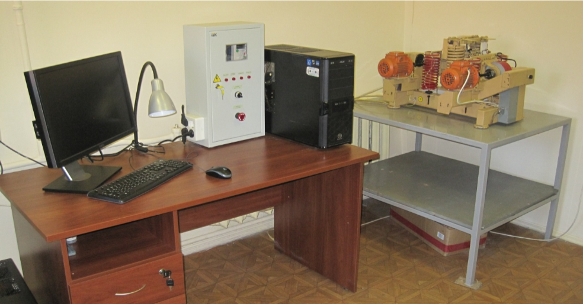
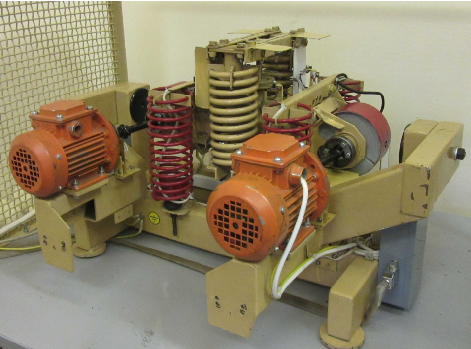
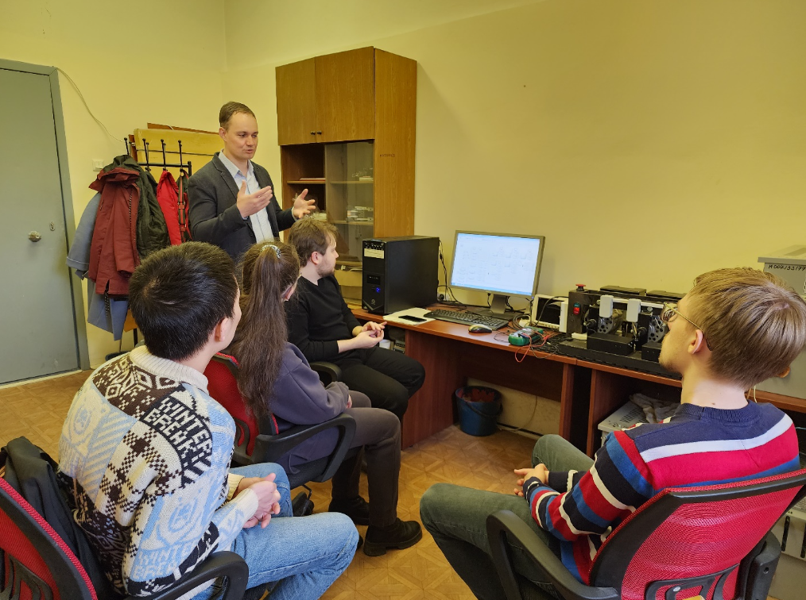
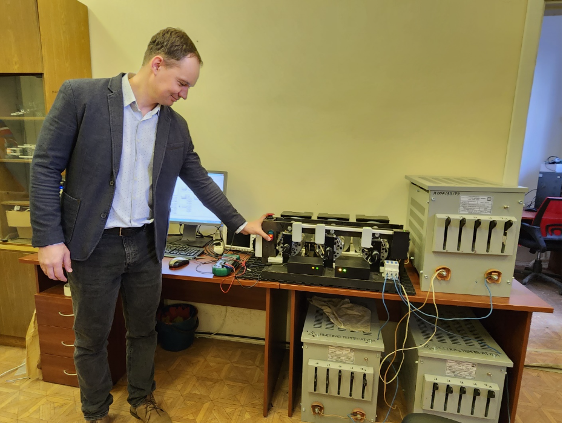
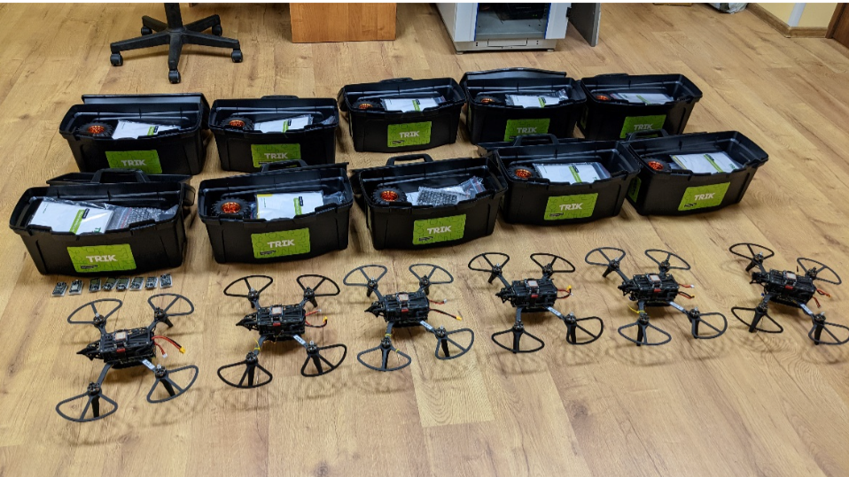
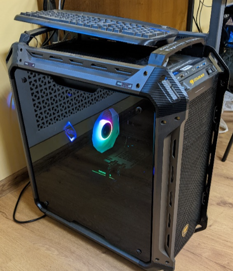
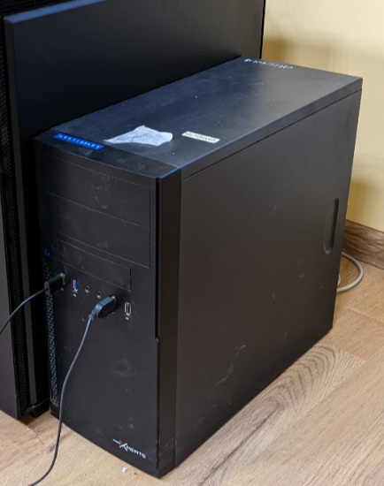

# Оборудование лаборатории

## Мехатронный вибрационный стенд

Двухроторный мехатронный вибрационный стенд СВ-2М. Предназначен для
исследования алгоритмов нелинейного и интеллектуального управления
вибрационными установками

## Стенд по изучению алгоритмов управления электроэнергетической сетью

Занятия со студентами на стенде проводит профессор И.Б.Фуртат.

## Стенд для тестирования новых алгоритмов группового управления

Оборудование для тестирования новых алгоритмов группового управления в
условиях отсутствия единого центра принятия решений. Для проведения
имитационного моделирования используются две базовые станции. Одна из
базовых станций имеет многоядерный процессор, в котором возможно
создать до 128-ми агентов. Для тестирования алгоритмов на практике был
сформирован набор из комплектов квадрокоптеров и конструкторов
колесных роботов. В этих роботах установлен дополнительный
микрокомпьютер, который позволяет добавлять новые алгоритмы
группового принятия решений без изменения программного обеспечения
управляющего бортового компьютера (автопилота). Также в комплект
тестового стенда включены микрокомпьютеры, на которых проводится
тестирование методов передачи данных перед использованием в роботах.

