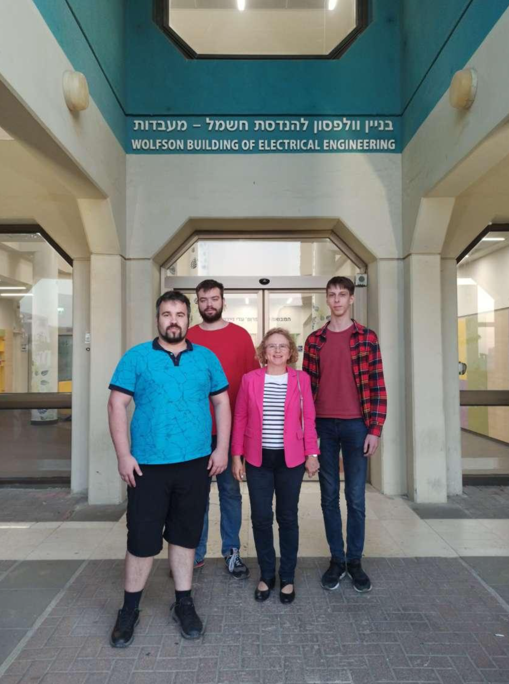
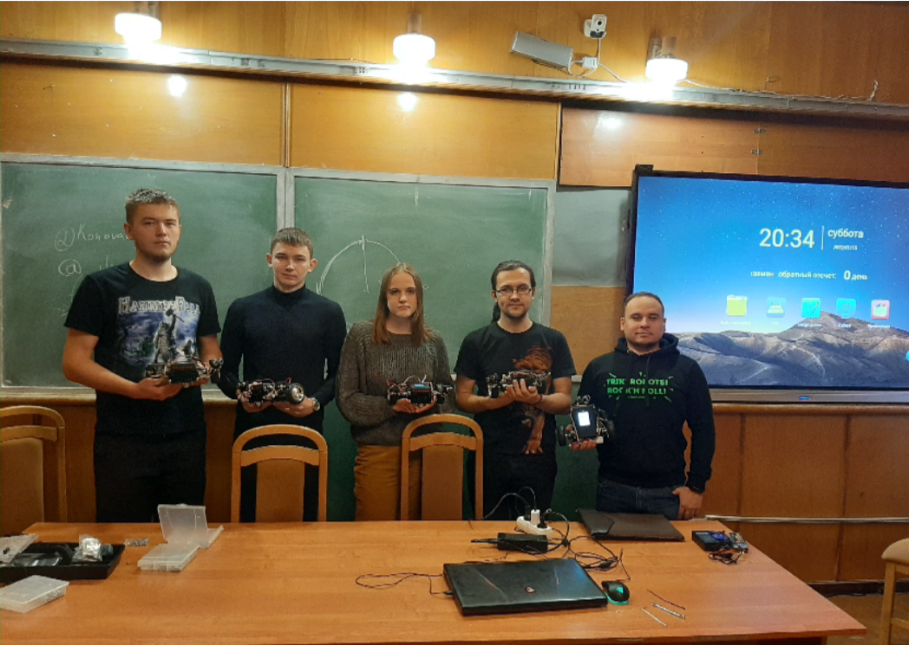

Студенты на стажировке у ведущего ученого в Тель-Авивском университете, (Тель-Авив, декабрь
2022 г.) Слева направо: Данила Семенов, Александр Семенов, проф. Эмилия Фридман, Александр
Ковальчуков

Студенты 3 курса, работающие по гранту, на практикуме по сборке роботов и управлению ими.
(ИПМаш РАН, январь 2022 г)

Слева направо: Михаил Лаврухин, Артур Сагатдинов, Александра Рыбалко, Петр Коновалов,
преподаватель, разработчик робототехнического конструктора ТРИК Илья Широколобов

<!-- # Сотрудники -->

<!-- 

## Руководитель – ведущий ученый:
Проф. Эмилия Фридман, Тель-Авивский университет

## Ключевые исполнители

Беляев Александр Константинович зав.лаб., чл.-корр. РАН, д.ф.-м.н., Зам. руководителя лаборатории

Фрадков Александр Львович, зав.лаб., д.т.н., Ответственный исполнитель

Фуртат Игорь Борисович зав.лаб., д.т.н., Ответственный исполнитель

Андриевский Борис Ростиславич, в.н.с. , д.т.н.

Граничин Олег Николаевич проф. СПбГУ д.ф.-м.н.

Матвеев Алексей Серафимович проф. СПбГУ д.ф.-м.н.

Орлов Юрий Владимирович, проф. CICESE,(Мексика), д.ф.-м.н.

Порубов Алексей Викторович зав.лаб, д.ф.-м.н.

## Исполнители

## Аспиранты и студенты

 -->

